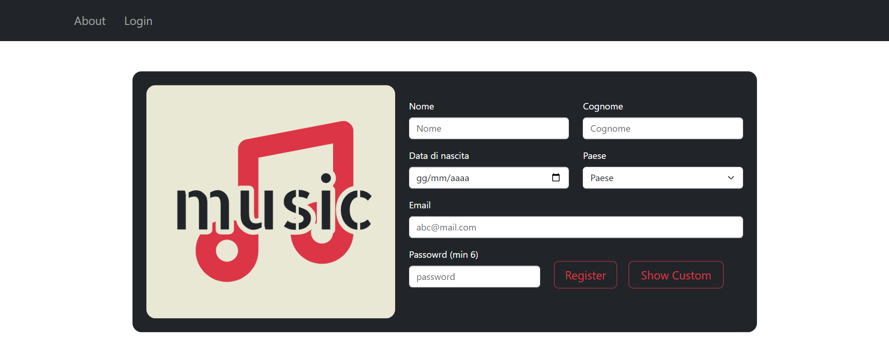
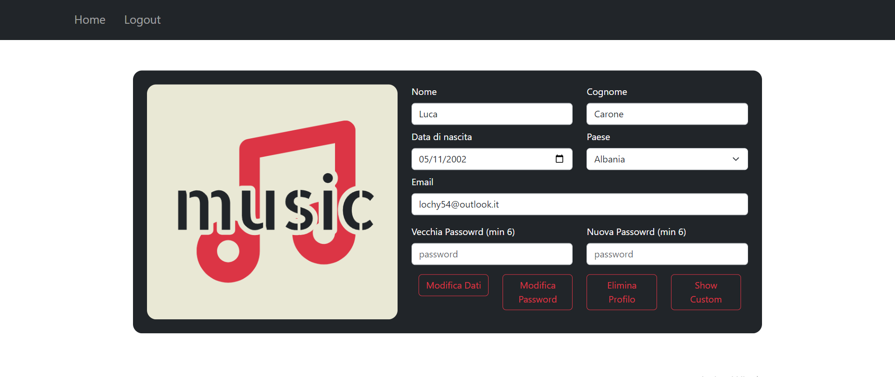
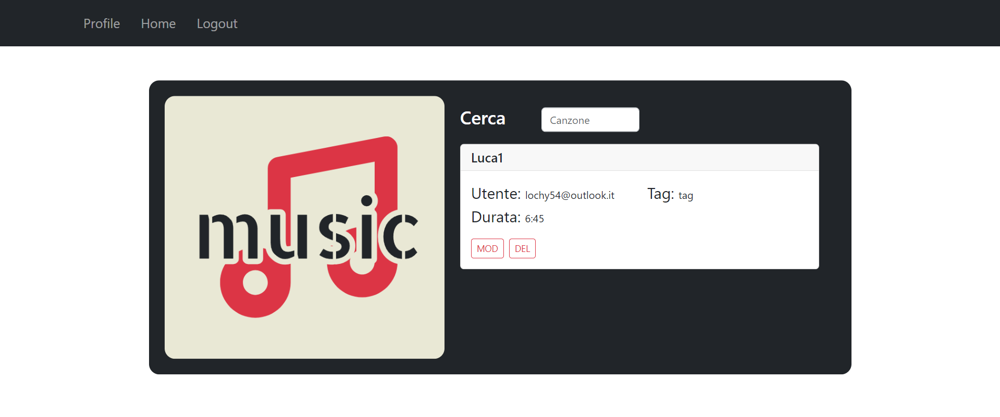
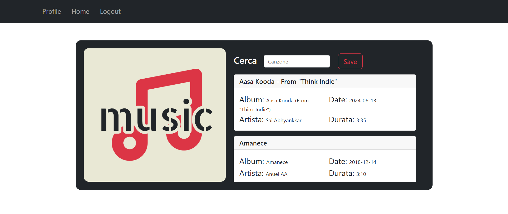

## Relazione progetto
Il progetto si propone di sviluppare un'applicazione web per la gestione e la condivisione di playlist musicali tra utenti.  
L'applicazione permette di:
+ registrare un utente creando profili personalizzati
+ gestire le playlist 
+ condividere le playlist create con una comunità
L'applicazione sarà sviluppata usando come framework bootstrap per renderla totalmente responsiva.
## Analisi dei requisiti
Il progetto è composto da tre principali macro-scenari: gestione degli utenti, gestione delle playlist e gestione delle condivisioni. Ogni utente, una volta registrato, può creare e modificare il proprio profilo, organizzare playlist personalizzate attingendo ai dati forniti tramite le API REST di Spotify, e condividere queste playlist con altri utenti. Le playlist possono essere cercate e visualizzate attraverso criteri di ricerca specifici come tag e titolo.
## Proflio utente FRONT-END spiegazione interfaccie
### Registrazine:
Basterà inserire i relativi dati nel form di registrazione. 

Cliccando show custom si apriranno le info aggiuntive.

La ricerca degli artisti viene effettuata usando le api di spotyfi, una volta c'ercato un artista basterà aggiungerlo o rimuoverolo.

Una volta finita la registrazione basterà premere reigstra.
Apparirà un banner per capire se la registrazione è avvenuta con sucesso o meno.

### Login:
Per effettuare un login basterà inserire i dati nel form e premere login.

### Forgot password
Se la mail esiste invia una richiesta di reset password al server che viene stampata nella console.

### Homepage utente
Qui si potrà:
+ visualizzare il proprio profilo per:
    + eliminarlo
    + modificarlo
+ effettuare logout
+ creare una playlist (crea)
+ modificare una playlist (modifica)
    + eliminarla
    + modificarla
+ cercare una playlist di un altro utente (eventualmente aggiungendo la playlist al proprio profilo)
+ visualizzare la libreria delle playlist personali + aggiunte

### Profile
Tramite questa interfaccia è possibile modificare tutti i dati del profilo.
Una volta modificato un dato basterà premere modifica dati per inviare la richiesta.

Per modificare la password sarà necessario inserire anche la veccghia password per motivi di sicurezza. Dopodichè si dovrà premere su modifica password.

Premendo show custom si potranno visualizzare anche le info aggiuntive sul profilo.

Per eliminare il profilo basterà premere su elimina profilo.

Premendo il tasto home si tornerà alla schermata principale. Una volta inviata la richiesta apparirà un banner con lo stato.
### Logout
Premendo logout si uscirà dal prifilo tornando alla pagina di login.
### Crea
In questa pagina sarà possiblie creare una playlist inserendo:
+ Titolo
+ Descrizione
+ Tag
+ pubblica o privata

una volta inseriti i campi obbligatori si potrà creare la playlist vuota o aggiungere ad essa delle canzoni.

una volta cercata una canzone si potrà aggiungerla o rimuoverla a piacimento. Una volota aggiunta una canzone il timer del "totale" aumenterà del tempo necessario.

Una volta inviata la richiesta apparirà un banner con lo stato.
Premendo il tasto home si tornerà alla schermata principale.

### Modifica
In questa interfaccia 
