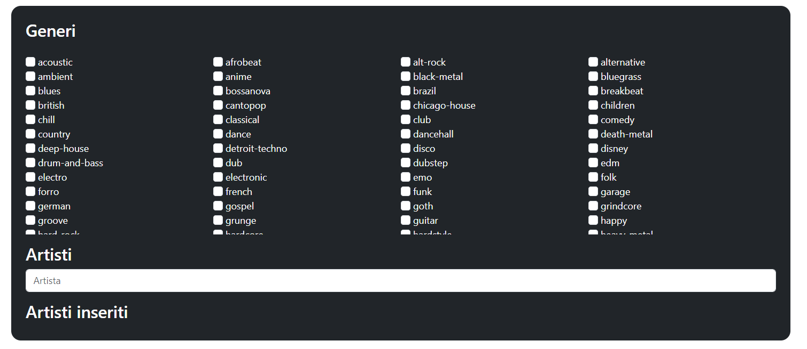
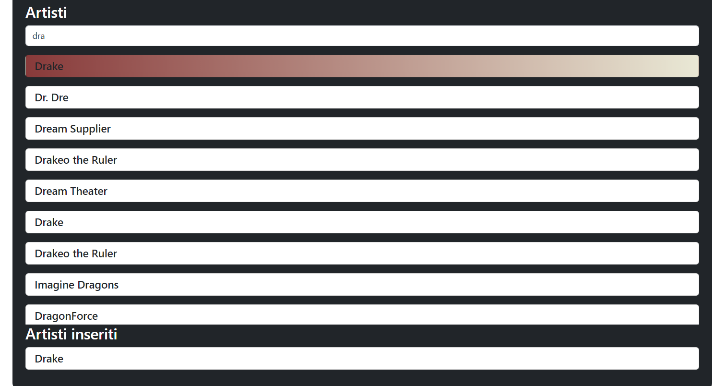

# Relazione progetto
Il progetto si propone di sviluppare un'applicazione web per la gestione e la condivisione di playlist musicali tra utenti. <br>
L'applicazione permette di:
+ registrare un utente creando profili personalizzati
+ gestire le playlist 
+ condividere le playlist create con una comunità

L'applicazione sarà sviluppata usando come framework bootstrap per renderla totalmente responsiva.
# Analisi dei requisiti
Il progetto è composto da tre principali macro-scenari: + gestione degli utenti
+ gestione delle playlist 
+ gestione delle condivisioni

Ogni utente, una volta registrato, può creare e modificare il proprio profilo, organizzare playlist personalizzate attingendo ai dati forniti tramite le API REST di Spotify e condividere queste playlist con altri utenti. Le playlist possono essere cercate e visualizzate attraverso criteri di ricerca specifici come tag e titolo.
# Proflio utente FRONT-END spiegazione interfaccie
## Registrazine:
Basterà inserire i relativi dati nel form di registrazione. 


Cliccando show custom si apriranno le info aggiuntive.


La ricerca degli artisti viene effettuata usando le api di spotyfi, una volta cercato un artista basterà aggiungerlo o rimuoverolo.


Una volta finita la registrazione basterà premere reigstra.
Apparirà un banner per capire se la registrazione è avvenuta con sucesso o meno.



## Login:
Per effettuare un login basterà inserire i dati nel form e premere login.


## Forgot password
Se la mail esiste invia una richiesta di reset password al server, essa viene stampata nella console.


> Forgot passwor:  { email: 'lochy54@outlook.it' }

## Homepage utente
Qui si potrà:
+ visualizzare il proprio profilo per:
    + eliminarlo
    + modificarlo
+ effettuare logout
+ creare una playlist (crea)
+ modificare una playlist (modifica)
    + eliminarla
    + modificarla
+ cercare una playlist di un altro utente (eventualmente aggiungendo la playlist al proprio profilo)
+ visualizzare la libreria delle playlist personali + aggiunte


## Profile
Tramite questa interfaccia è possibile modificare tutti i dati del profilo.
Una volta modificato un dato basterà premere modifica dati per inviare la richiesta.

Per modificare la password sarà necessario inserire anche la veccghia password per motivi di sicurezza. Successivamente si dovrà premere su modifica password.

Premendo show custom si potranno visualizzare anche le info aggiuntive sul profilo.

Per eliminare il profilo basterà premere su elimina profilo.


Premendo il tasto home si tornerà alla schermata principale. 

Una volta inviata la richiesta apparirà un banner con lo stato.
## Logout
Premendo logout si uscirà dal prifilo tornando alla pagina di login.
## Crea
In questa pagina sarà possiblie creare una playlist inserendo:
+ Titolo
+ Descrizione
+ Tag
+ pubblica o privata

Una volta inseriti i campi obbligatori si potrà creare la playlist vuota o aggiungere ad essa delle canzoni.


Una volta cercata una canzone si potrà aggiungerla o rimuoverla a piacimento. Una volota aggiunta una canzone il timer del "totale" aumenterà del tempo necessario.

La ricerca delle canzioni viene effettuata attraverso le api di spotyfi.


Una volta inviata la richiesta apparirà un banner con lo stato.

Premendo il tasto home si tornerà alla schermata principale.

## Modifica
In questa interfaccia si potrà selezionare una plyalist da noi creata per:
+ modificarla
+ eliminarla

La schermata di modifica è analoga a quella di creazione

Per l'eliminazione basterà premere il tasto del è apparirà un banner per la conferma dello stato.


## Cerca
In questa pagina si potranno cercare playlist di altri utenti per aggiungerle alla nostra libreria. La ricerca potrà essere effettuata per tag o nome playlist


Premendo il tasto open si andrà ad aprire la playlist per controllarne il contenuto


Qui possiamo decidere se salvare la playlist nel nostro profilo o meno. E' possibile ricercare canzioni all'interno della playlist tramite la barra di ricerca.
Una volta salvata una playlist si tornerà alla schermata di ricerca playlsit.
## Libreria
In questa schermata è possibile visualizzare tutte le playlist della libreria.
+ Posso rimuovere delle playlist aggiunte da altri account
+ Visualizzare le playlist (aggiunte+create)


Per rimuovere una playlist aggiunt abasterà premere rim. Una volta inviata la richiesta sarà visualizzato un banner con lo stato di essa.

Il tato open permette di aprire una playlist ,visuallizarne il contenuto e cercare delle canzioni.

La ricerca potrà essere effettuata per tag o nome playlist
# Server BACK-END
## Server
Il back-end creato per gestire le risposte alle chiamate http del fornt-end utilizza express per creare un server sulla porta 3000.
``` js
const app = express(); // inizzializzazione
const port = 3000; // port
// Middleware 
app.use(express.json());
app.use(mongoSanitize());
app.use((req, res, next) => {
  res.setHeader("Access-Control-Allow-Origin", "*");
  res.setHeader("Access-Control-Allow-Methods", "POST, GET, PUT, DELETE");
  res.setHeader("Access-Control-Allow-Headers", "Content-Type");
  next();
})
```
All' interno di una funzione asincrona ci sarà l'avvio del server.
``` js
//setup generi ask ogni 5 min (potrebbero cambiare)
(async () => {
 ------
  // Start server
  app.listen(port, () => {
    console.log(`Server is running on port ${port}`);
  });
})();
```
## Funzioni aggiuntive server
Introduciamo 3 funzioni aggiuntive prima di analizzare le vartie routes:
### chektoken: 

Il server utilizza dei token do accesso generati ogni volta che un nuovo client effettua un login. Questi token saranno salvati dentro l'array dei toke assieme ad un timestap del tempo di inserimento e la mail dell' utente. Il token sarà succesivamente inviato al client, come risposta, per richieste future.
``` js
var tokenlis = [];
``` 
Ogni volta che un client fa una richiesta al server deve includere il token. Se il token è contenuto nel server e il timestap associato è minore di 10 minuti la richiesta sarà garantita e il  timestapm sarà aggiornato al tempo della nuova richiesta; in caso contrario la richiesta sarà rifiutata e il token sarà scartato.
``` js
//ce un token attivo , se cè aggiorno l'oriario
function chektoken(value) {
  const currentTime = new Date(); 
  const tenMinutesAgo = new Date(currentTime.getTime() - (5 * 100 * 1000)); 

  for (let index = 0; index < tokenlis.length; index++) {
      if (tokenlis[index].token === value) {
          if (tokenlis[index].time <= tenMinutesAgo) {
              tokenlis.splice(index, 1);
              return false;
          } else {
              tokenlis[index].time = currentTime; 
              console.log("Token aggiornato");
              return true;
          }
      }
  }

  // Se il token non è stato trovato
  return false;
}
```
### findtoken:
Per effettuare alcune ricerche nel db è necessario usare la mail dell' utente; dato che nelle varie richieste dell' utente non viene mai inclusa la mail ma soltanto il token esiste una funzione che dato un token attivo restituisce una mail.
``` js
//dato un token trova l'email
function findtoken(token){
  for (let index = 0; index < tokenlis.length; index++) {
    if (tokenlis[index].token === token) {
        return tokenlis[index].user;
        }}}
```
### getGeneri:

Donde evitare di richiedere i generi a spotyfi ogni volta che un nuovo client effettua un modifica del profilo o una registrazione, ho introdotto questa funzione asincorna che ogni 5 minuti ridviede i generi e li salva nell array dei generi del server.
``` js
//setup generi ask ogni 5 min (potrebbero cambiare)
(async () => {
  generi = await getgenere();
  setInterval(async () => {
    generi = await getgenere();
  }, 5 * 60 * 1000);
---
})();
```
### Zod
Questo pacchetto viene ustato per controllare che i dati mandati dal client, nelle varie richieste, siano corretti e rispettino gli standard assegniati, prima di inserirli nel db.
``` js
import { z } from 'zod';
const userDataSchema = z.object({
    nome: z.string().min(2),
    cognome: z.string().min(2),
    data: z.date(), 
    paese: z.string(),
    email: z.string().email(),
    artisti: z.array(z.string().min(2)).default([]),
});
---
try {
    userData.data= new Date(userData.data);
    userDataSchema.parse(userData);
----
```

## Spotyfi api
Questa parte di codice introduce una funzione che restituisce un client spotyfi che ci permette di farre chiamate sfruttando le api
```js
import request  from "request";
import SpotifyWebApi from "spotify-web-api-node";
async function gettoken() {
    const client_id = '80c861fd6b084de3bddd82e305be6fcc';
    const client_secret = '0d45b84ca78e436eaf57b2a7d8961944';
    const authOptions = {
        url: 'https://accounts.spotify.com/api/token',
        headers: {
          'Authorization': 'Basic ' + (new Buffer.from(client_id + ':' + client_secret).toString('base64'))
        },
        form: {
          grant_type: 'client_credentials'
        },
        json: true
    };
    return new Promise((resolve, reject) => {
        request.post(authOptions, function(error, response, body) {
            if (!error && response.statusCode === 200) {
                resolve(body.access_token);
            } else {
                reject(error);
            }
        });
    });
}
async function getapi() {

        var access_token = await gettoken();
        var spotifyApi = new SpotifyWebApi();
        spotifyApi.setAccessToken(access_token);
        return spotifyApi;
}
export {getapi}
```
Utilizzando il client id e il client seacret (presi dalla pagina ufficiale di spotyfi) genero un token per effettuare richieste al server di spotyfi. Questo token sarà poi uato per inizzializzare un client che sarà poi usato per le varie richieste http.
## Mongodb
### Connect
Questa parte di codice inplementa una funzione che ritorna un mongoClient usato per fare chiamate al db.
``` js
import { MongoClient } from 'mongodb';
async function connectToCluster() {
    let mongoClient;
 
    try {
        mongoClient = new MongoClient("mongodb://localhost:27017");
        await mongoClient.connect(); 
        return mongoClient;
    } catch (error) {
        throw new Error ('problemi di connesione');
    }
 }
export {connectToCluster};
```
Una volta connesso al db ritorna il client sul quale fare le operazioni.
### Sanitize
Utilizzo mongoSanitize per pulire tutte le query che effettou verso il db (donde evitare una no-sqlInjection).
``` js
import mongoSanitize from 'express-mongo-sanitize';
app.use(mongoSanitize());
```

# MongoDB
## Collezzioni
Nel mio db ho 2 collezioni:
### Utenti

Un utente è una persona che si è registrata al sito
  + id: identificativo univoco dell profilo
  + nome: nome del registrato
  + cognome: cognome del registrato
  + data: data di nascita del registrato
  + paese: paese del registrato
  + email: email del registrato
  + password: password del profilo
  + generi: generi che piaciono al registrato
  + artisti: artisti che piaciono al registrato

negli utenti ho 2 indici unici:


Oltre all'id ho impostato come indice unco anche l'email (ogni email può essere registrata una sola volta dato che identifica un utente nel db)
### Playlist


Una playlist è una collezione di canzoni
+ id:  identificativo univoco della playlist
+ nome: nome della playlist
+ tag: tag della playlist
+ descrizione: breve descrizione testuale della playlist
+ canzoni: array di id delle canzoni aggiunte alla playlist
+ public: bool che idenstifica se la playlist è pubblica o privata
+ durata: durata della playlist in ms
+ email: lista di email che hanno la playlist in libreria
  - posizione 0 : creatore della playlist
  - posizione n: coloro che hanno aggiunto la playlist in libreria

Dato che i collegameti profilo-playlist sono salvati un un record della playlist stessa, se il creatore di una playlist la elimina scomparà a tutti.

nelle playlis ho 2 indici unici:


Oltre all'id ho impostato come indice unco anche la coppia emial-nomePlaylist (gli utenti non possono creare playlist con lo stesso nome di playlist già create dal loro profilo (attive)).
# Swagger
E attivo lo swagger dell varie route del server.
``` js
import swaggerUi from "swagger-ui-express";
import swaggerDocument  from "./swagger-output.json" with { type: "json" };
---
app.use('/api-docs', swaggerUi.serve, swaggerUi.setup(swaggerDocument ));
```
Si può accedere ad esso sul localhost alla porta 3000 /api-docs.
## Routes:
### Genere
Questa route serve per richiedere la lista dei generi utilizzando le api di spotyfi. Ritorna 200 e la lista di generi
``` js
app.get('/genere', (req, res) => {
  console.log("generi richiesti");
  res.status(200).json(generi);
});
```
### Elimina
Questa route serve per eliminare un profilo. In caso l'eliminazione venga eseguita con sucesso rotorna 200, nel caso si sia verificato un errore in fase di risposta o eliminazione manda uno status 500.
``` js
app.delete('/elimina', async (req, res) => {
  console.log("Received elimination request with message:", req.body);
  if(chektoken(req.body.token)){
    let v = await elimina(findtoken(req.body.token))
    res.status(v.code).json(v);
  }else{
    res.status(500).json({ res:false ,  code:500});
  }
});
```
### modplaylist1
Dato un token (attivo) di un profilo restutuisce le playlist create e ancora attive di quel profilo (200), nel caso si sia verificato un errore in fase di risposta o ricerca manda uno status 500.
``` js
app.post('/modplaylist1', async (req, res) => {
  console.log("Received mod request with message:", req.body);
  if(chektoken(req.body.token)){
    let v = await modplaylist1(findtoken(req.body.token))
    res.status(v.code).json(v);
  }else{
    res.status(500).json({ res:false ,  code:500});
  }
});
```
### modplaylist2
Dato un token (attivo) di un profilo e un nome di una playlist creata da quel profilo e ancora attiva trova e ritorna le canzoni della playlist cercata (200), nel caso si sia verificato un errore in fase di ricerca o risposta manda uno status 500.
```js
app.post('/modplaylist2', async (req, res) => {
  console.log("Received mod request with message:", req.body);
  if(chektoken(req.body.token)){
    let v = await modplaylist2(findtoken(req.body.token) ,req.body.playlist)
    res.status(v.code).json(v);
  }else{
    res.status(500).json({ res:false ,  code:500});
  }
});
```
### modplaylist3
Dato un token (attivo) di un profilo trova e ritorna le playlist create e non da quel profilo ancora attive (200), nel caso si sia verificato un errore in fase di ricerca o risposta manda uno status 500.
```js
app.post('/modplaylist3', async (req, res) => {
  console.log("Received mod request with message:", req.body);
  if(chektoken(req.body.token)){
    let v = await modplaylist3(findtoken(req.body.token))
    res.status(v.code).json(v);
  }else{
    res.status(500).json({ res:false ,  code:500});
  }
});
```
### eliminaPlaylist
Dato un token (attivo) di un profilo e un nome di una playlist elimina la playlist di quel profilo (200), nel caso si sia verificato un errore in fase di eliminazione o risposta manda uno status 500. Tutti gli altri utenti che si sono salvati la playlist non la vedranno più.
``` js
app.delete('/eliminaPlaylist', async (req, res) => {
  console.log("Received mod request with message:", req.body);
  if(chektoken(req.body.token)){
    let v = await delPlaylist(findtoken(req.body.token),req.body.nome)
    res.status(v.code).json(v);
  }else{
    res.status(500).json({ res:false ,  code:500 });
  }
});
```
### togliPlaylist
Dato un token (attivo) di un profilo e un nome di una playlist toglie la playlist di quel profilo (200), nel caso si sia verificato un errore in fase di eliminazione o risposta manda uno status 500. La playlist rimarrà attiva negli altri profili in cui è stata salvata.
``` js
app.delete('/togliPlaylist', async (req, res) => {
  console.log("Received mod request with message:", req.body);
  if(chektoken(req.body.token)){
    let v = await remPlaylist(findtoken(req.body.token),req.body.nome)
    res.status(v.code).json(v);
  }else{
    res.status(500).json({ res:false ,  code:500});
  }
});
```
### modplaylist5
Dato un token (attivo) di un profilo trova e ritorna le playlist non create e non aggiunte dall'utente (200), nel caso si sia verificato un errore in fase di ricerca o risposta manda uno status 500.
``` js
app.post('/modplaylist5', async (req, res) => {
  console.log("Received mod request with message:", req.body);
  if(chektoken(req.body.token)){
    let v = await modplaylist5(findtoken(req.body.token))
    res.status(v.code).json(v);
  }else{
    res.status(500).json({ res:false ,  code:500});
  }
});
```
### modplaylist6
Dato un token (attivo) di un profilo e un nome di una playlist non creata da quel profilo e ancora attiva trova e ritorna le canzoni della playlist cercata (200), nel caso si sia verificato un errore in fase di ricerca o risposta manda uno status 500.
``` js
app.post('/modplaylist6', async (req, res) => {
  console.log("Received mod request with message:", req.body);
  if(chektoken(req.body.token)){
    let v = await modplaylist2(req.body.emailpass,req.body.playlist)
    res.status(v.code).json(v);
  }else{
    res.status(500).json({ res:false ,  code:500});
  }
});
```
### register
Registra un nuovo utrente nella piattaforma (200), nel caso ci siano problemi in fase di inserimento manda uno status 500, nel casoci siano problemi di controllo dei dati inseriti manda uno status 400.
``` js
app.put('/register', async (req, res) => {
  console.log("Received registration request with message:", req.body);
  let v = await register(req.body,generi)
  console.log(v);
  res.status(v.code).json(v);
});
```
### login
Effettua il login di un utrente nella piattaforma (200), nel caso ci siano problemi in fase di connessione manda uno status 500, nel casoci siano problemi di controllo dei dati inseriti manda uno status 400. Inoltre crea il token di accesso, lo salva nel server assieme al timestamp e lo manda all'utente (per chiamate future).
``` js
app.post('/login', async (req, res) => {
  console.log("Received login request with message:", req.body);
  let v = await login(req.body)
  console.log(v);
  res.status(v.code).json(v);
  if(v.res!=false){
   if(!chektoken(v.res)){
      tokenlis.push({token: v.res , time: new Date() , user: req.body.email})
      console.log(tokenlis);
  }}
});
```
### logout
Effettua il logout di un utrente dalla piattaforma (200) rimuovendo il token dalla lista dei token presenti.
``` js
app.post('/logout', (req, res) => {
  console.log("Received logout request with message:", req.body);
      for (let index = 0; index < tokenlis.length; index++) {
        if (tokenlis[index].token === req.body.token) {
            tokenlis.splice(index, 1);
            console.log("rimuovo "+req.body.token);
          }}  
    res.status(200).json({ res:true , code:200});
});
```
### mod
Dato un token (attivo) di un profilo restituisce i dati di tale profilo (200),nel caso ci siano problemi in fase di connessione manda uno status 500.
``` js
app.post('/mod', async (req, res) => {
  console.log("Received mod request with message:", req.body);
  if(chektoken(req.body.token)){
    let v = await mod(findtoken(req.body.token))
    res.status(v.code).json(v);
  }else{
    res.status(500).json({ res:false ,  code:500});
  }
});
```
### modPass
Dato un token (attivo) di un profilo , la nuova password e la vecchia password imposta la password a quella nuova (200), nel caso ci siano problemi in fase di connessione manda uno status 500, nel casoci siano problemi di controllo dei dati inseriti manda uno status 400.
``` js
app.put('/modPass', async(req, res) => {
  console.log("modifica richiesta: ", req.body);
  if(chektoken(req.body.token)){
    let v = await modPass(req.body,findtoken(req.body.token))
    res.status(v.code).json(v);
  }else{
    res.status(500).json({ res:false ,  code:500});
  }
});
```
### modData
Dato un token (attivo) di un profilo e un json di campi da modificare aggiorna i dati del profilo (200), nel caso ci siano problemi in fase di connessione manda uno status 500, nel casoci siano problemi di controllo dei dati inseriti manda uno status 400.
``` js
app.put('/modData', async(req, res) => {
  var tokenre = req.body.token;
  delete req.body.token;
  console.log("modifica richiesta: ", req.body);
  if(chektoken(tokenre)){
    let v = await modData(req.body,findtoken(tokenre),generi)
    res.status(v.code).json(v);
  for (let index = 0; index < tokenlis.length; index++) {
    if (tokenlis[index].token === tokenre) {
        tokenlis[index].user= req.body.email;
        console.log(tokenlis)
    }}
  }else{
    res.status(500).json({ res:false ,  code:500});
  }
});
```

### ADDplaylist
 Dato un token (attivo) di un profilo, una mail del creante di una playlist e il nome della playlist al quale mi voglio aggiungere, aggiungo al mio profilo la playlist (200), nel caso ci siano problemi in fase di connessione o aggiunta manda uno status 500.
``` js
app.put('/ADDplaylist', async (req, res) => {
  console.log("Received add request with message:", req.body);
  if(chektoken(req.body.token)){
    let v = await ADDplay(findtoken(req.body.token),req.body.emailpass,req.body.playlist)
    res.status(v.code).json(v);
  }else{
    res.status(500).json({ res:false ,  code:500});
  }
});
```

### ADDplaylist
 Dato un token (attivo) di un profilo e un dato da cercare (artista, nome canzone, album) cercca le canzoni più simili a quel caso e le restituisce(200), nel caso ci siano problemi in fase di connessione o ricerca manda uno status 500.
``` js
app.post('/cerca', async (req, res) => {
  console.log("cercato", req.body.cercato);
  if(chektoken(req.body.token)){
    let v = await cercato(req.body.cercato)
    res.status(v.code).json(v);
  }else{
    res.status(500).json({ res:false ,  code:500});
  }
});
```
### artisti
 Dato un artista da cercare, lo cerca e le restituisce(200), nel caso ci siano problemi in fase di connessione o ricerca manda uno status 500.
``` js
app.post('/artisti', async (req, res) => {
  console.log("cercato", req.body.cercato);
    let v = await artisti(req.body.cercato)
    res.status(v.code).json(v);
});
```
### salva
Dato un token (attivo) di un profilo e un json di una playlist, la salva nel profilo(200). Nel caso ci siano problemi in fase di connessione o savltaggio manda uno status 500, nel caso ci siano problemi di controllo dei dati inseriti manda uno status 400.
``` js
app.put('/salva', async (req, res) => {
  console.log("salva playlist: ", req.body);
  if(chektoken(req.body.token)){
    let v = await salva(req.body, findtoken(req.body.token))
    res.status(v.code).json(v);
  }else{
    res.status(500).json({ res:false ,  code:500});
  }
});
```

### salvaMod
Dato un token (attivo) di un profilo e un json di una playlist, salva le modifiche nel profilo(200). Nel caso ci siano problemi in fase di connessione o salvataggio manda uno status 500, nel caso ci siano problemi di controllo dei dati inseriti manda uno status 400.
``` js
app.put('/salvaMod', async (req, res) => {
  console.log("salva playlist: ", req.body);
  if(chektoken(req.body.token)){
    let v = await salvaMod(req.body)
    res.status(v.code).json(v);
  }else{
    res.status(500).json({ res:false ,  code:500});
  }
});
```


### forgot
Riceve una richiesta di password forgot e la stampa in console.
``` js
app.post('/forgot', async (req, res) => {
  console.log("Forgot passwor: ", req.body);
    res.json(forgot(req.body.email));

});
```