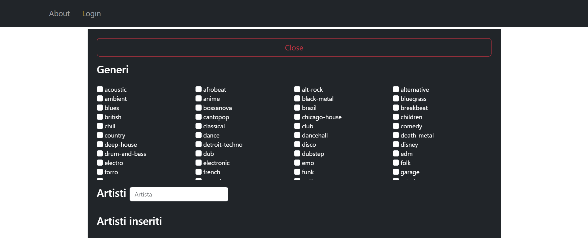
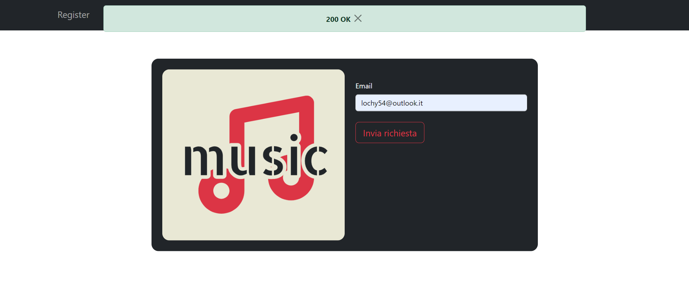
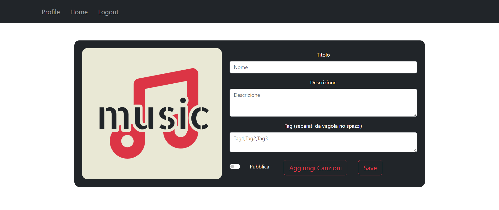

# Relazione progetto
Il progetto si propone di sviluppare un'applicazione web per la gestione e la condivisione di playlist musicali tra utenti. <br>
L'applicazione permette di:
+ registrare un utente creando profili personalizzati
+ gestire le playlist 
+ condividere le playlist create con una comunità

L'applicazione sarà sviluppata usando come framework bootstrap per renderla totalmente responsiva.
# Analisi dei requisiti
Il progetto è composto da tre principali macro-scenari: + gestione degli utenti
+ gestione delle playlist 
+ gestione delle condivisioni

Ogni utente, una volta registrato, può creare e modificare il proprio profilo, organizzare playlist personalizzate attingendo ai dati forniti tramite le API REST di Spotify e condividere queste playlist con altri utenti. Le playlist possono essere cercate e visualizzate attraverso criteri di ricerca specifici come tag e titolo.
# Proflio utente FRONT-END spiegazione interfaccie
## Registrazine:
Basterà inserire i relativi dati nel form di registrazione. 


Cliccando show custom si apriranno le info aggiuntive.



La ricerca degli artisti viene effettuata usando le api di spotyfi, una volta cercato un artista basterà aggiungerlo o rimuoverolo.


Una volta finita la registrazione basterà premere reigstra.
Apparirà un banner per capire se la registrazione è avvenuta con sucesso o meno.


## Login:
Per effettuare un login basterà inserire i dati nel form e premere login.


## Forgot password
Se la mail esiste invia una richiesta di reset password al server, essa viene stampata nella console.


> Forgot passwor:  { email: 'lochy54@outlook.it' }

## Homepage utente
Qui si potrà:
+ visualizzare il proprio profilo per:
    + eliminarlo
    + modificarlo
+ effettuare logout
+ creare una playlist (crea)
+ modificare una playlist (modifica)
    + eliminarla
    + modificarla
+ cercare una playlist di un altro utente (eventualmente aggiungendo la playlist al proprio profilo)
+ visualizzare la libreria delle playlist personali + aggiunte


## Profile
Tramite questa interfaccia è possibile modificare tutti i dati del profilo.
Una volta modificato un dato basterà premere modifica dati per inviare la richiesta.

Per modificare la password sarà necessario inserire anche la veccghia password per motivi di sicurezza. Successivamente si dovrà premere su modifica password.

Premendo show custom si potranno visualizzare anche le info aggiuntive sul profilo.

Per eliminare il profilo basterà premere su elimina profilo.


Premendo il tasto home si tornerà alla schermata principale. 

Una volta inviata la richiesta apparirà un banner con lo stato.
## Logout
Premendo logout si uscirà dal prifilo tornando alla pagina di login.
## Crea
In questa pagina sarà possiblie creare una playlist inserendo:
+ Titolo
+ Descrizione
+ Tag
+ pubblica o privata

Una volta inseriti i campi obbligatori si potrà creare la playlist vuota o aggiungere ad essa delle canzoni.



Una volta cercata una canzone si potrà aggiungerla o rimuoverla a piacimento. Una volota aggiunta una canzone il timer del "totale" aumenterà del tempo necessario.

La ricerca delle canzioni viene effettuata attraverso le api di spotyfi.


Una volta inviata la richiesta apparirà un banner con lo stato.

Premendo il tasto home si tornerà alla schermata principale.

## Modifica
In questa interfaccia si potrà selezionare una plyalist da noi creata per:
+ modificarla
+ eliminarla

La schermata di modifica è analoga a quella di creazione

Per l'eliminazione basterà premere il tasto del è apparirà un banner per la conferma dello stato.


## Cerca
In questa pagina si potranno cercare playlist di altri utenti per aggiungerle alla nostra libreria. La ricerca potrà essere effettuata per tag o nome playlist


Premendo il tasto open si andrà ad aprire la playlist per controllarne il contenuto


Qui possiamo decidere se salvare la playlist nel nostro profilo o meno. E' possibile ricercare canzioni all'interno della playlist tramite la barra di ricerca.
Una volta salvata una playlist si tornerà alla schermata di ricerca playlsit.
## Libreria
In questa schermata è possibile visualizzare tutte le playlist della libreria.
+ Posso rimuovere delle playlist aggiunte da altri account
+ Visualizzare le playlist (aggiunte+create)


Per rimuovere una playlist aggiunt abasterà premere rim. Una volta inviata la richiesta sarà visualizzato un banner con lo stato di essa.

Il tato open permette di aprire una playlist ,visuallizarne il contenuto e cercare delle canzioni.

La ricerca potrà essere effettuata per tag o nome playlist
# Server BACK-END
## Server
Il back-end creato per gestire le risposte alle chiamate http del fornt-end utilizza express per creare un server sulla porta 3000.
``` js
const app = express(); // inizzializzazione
const port = 3000; // port
// Middleware 
app.use(express.json());
app.use(mongoSanitize());
app.use((req, res, next) => {
  res.setHeader("Access-Control-Allow-Origin", "*");
  res.setHeader("Access-Control-Allow-Methods", "POST, GET, PUT, DELETE");
  res.setHeader("Access-Control-Allow-Headers", "Content-Type");
  next();
})
```
All' interno di una funzione asincrona ci sarà l'avvio del server.
``` js
//setup generi ask ogni 5 min (potrebbero cambiare)
(async () => {
 ------
  // Start server
  app.listen(port, () => {
    console.log(`Server is running on port ${port}`);
  });
})();
```
## Funzioni aggiuntive server
Introduciamo 3 funzioni aggiuntive prima di analizzare le vartie routes:
### chektoken: 

Il server utilizza dei token do accesso generati ogni volta che un nuovo client effettua un login. Questi token saranno salvati dentro l'array dei toke assieme ad un timestap del tempo di inserimento e la mail dell' utente. Il token sarà succesivamente inviato al client, come risposta, per richieste future.
``` js
var tokenlis = [];
``` 
Ogni volta che un client fa una richiesta al server deve includere il token. Se il token è contenuto nel server e il timestap associato è minore di 10 minuti la richiesta sarà garantita e il  timestapm sarà aggiornato al tempo della nuova richiesta; in caso contrario la richiesta sarà rifiutata e il token sarà scartato.
``` js
//ce un token attivo , se cè aggiorno l'oriario
function chektoken(value) {
  const currentTime = new Date(); 
  const tenMinutesAgo = new Date(currentTime.getTime() - (5 * 100 * 1000)); 

  for (let index = 0; index < tokenlis.length; index++) {
      if (tokenlis[index].token === value) {
          if (tokenlis[index].time <= tenMinutesAgo) {
              tokenlis.splice(index, 1);
              return false;
          } else {
              tokenlis[index].time = currentTime; 
              console.log("Token aggiornato");
              return true;
          }
      }
  }

  // Se il token non è stato trovato
  return false;
}
```
### findtoken:
Per effettuare alcune ricerche nel db è necessario usare la mail dell' utente; dato che nelle varie richieste dell' utente non viene mai inclusa la mail ma soltanto il token esiste una funzione che dato un token attivo restituisce una mail.
``` js
//dato un token trova l'email
function findtoken(token){
  for (let index = 0; index < tokenlis.length; index++) {
    if (tokenlis[index].token === token) {
        return tokenlis[index].user;
        }}}
```
### getGeneri:

Donde evitare di richiedere i generi a spotyfi ogni volta che un nuovo client effettua un modifica del profilo o una registrazione, ho introdotto questa funzione asincorna che ogni 5 minuti ridviede i generi e li salva nell array dei generi del server.
``` js
//setup generi ask ogni 5 min (potrebbero cambiare)
(async () => {
  generi = await getgenere();
  setInterval(async () => {
    generi = await getgenere();
  }, 5 * 60 * 1000);
---
})();
```
## Routes:


