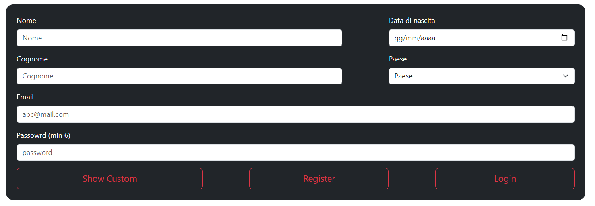
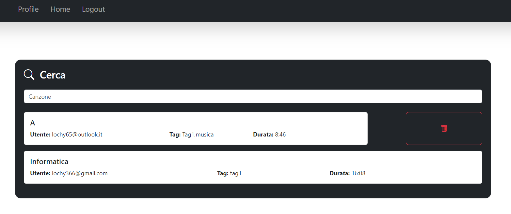

# GITHUB

- https://github.com/lochy54/WEB
- [Luca Carone Polettini](https://github.com/lochy54) MAT:05099A

# Relazione progetto

Il progetto si propone di sviluppare un'applicazione web per la gestione e la condivisione di playlist musicali tra utenti. <br> L'applicazione permette di:

- **Registrare un utente creando profili personalizzati**.
- **Gestire le playlist**.
- **Condividere le playlist create da una comunità**.

L'applicazione sarà sviluppata usando il framework **Bootstrap** per renderla totalmente responsiva.

# Analisi dei requisiti

Il progetto è composto da tre principali macro-scenari:

1. **Gestione degli utenti**.
2. **Gestione delle playlist**.
3. **Gestione delle condivisioni**.

Ogni utente, una volta registrato, può:
+ Creare e modificare il proprio profilo.
+ Organizzare playlist personalizzate utilizzando i dati forniti dalle **API REST di Spotify**.
+ Condividere queste playlist con altri utenti. 

Le playlist possono essere cercate e visualizzate attraverso dei criteri di ricerca specifici, come **tag** e **titolo**.

# MongoDB

Nel mio db ho 2 collezioni:
+ **Utenti**.
+ **Playlist**.

## Utenti


Un **utente** è una persona che si è registrata al sito, contiene:

- **id**: identificativo univoco dell profilo.
- **nome**: nome del registrato.
- **cognome**: cognome del registrato.
- **data**: data di nascita del registrato.
- **paese**: paese del registrato.
- **email**: email del registrato.
- **password**: password del profilo.
- **generi**: generi che piaciono al registrato.
- **artisti**: artisti che piaciono al registrato.

Negli **utenti** ho 2 indici unici:


Oltre all'**id** ho impostato come indice unco anche l'**email** (ogni email può essere registrata una sola volta dato che identifica un utente nel db)

## Playlist


Una **playlist** è una collezione di canzoni, contiene:

- **id**: identificativo univoco della playlist.
- **nome**: nome della playlist.
- **tag**: tag della playlist.
- **descrizione**: breve descrizione testuale della playlist.
- **canzoni**: array di id delle canzoni aggiunte alla playlist.
- **public**: bool che identifica se la playlist è pubblica o privata.
- **durata**: durata della playlist in ms.
- **email**: lista di email che hanno la playlist in libreria.
  - posizione 0 : creatore della playlist.
  - posizione n: coloro che hanno aggiunto la playlist in libreria.

Dato che i collegameti **profilo-playlist** sono salvati un un record della playlist stessa, se il creatore di una playlist la elimina scomparà a tutti. Nelle **playlist** ho 2 indici unici:


Oltre all'**id** ho impostato come indice unco anche la coppia **email-nomePlaylist** (gli utenti non possono creare playlist con lo stesso nome di playlist già create dal loro profilo (attive)).

# Swagger

E attivo lo **swagger** dell varie route del server.

```js
import swaggerUi from "swagger-ui-express";
import swaggerDocument  from "./swagger-output.json" with { type: "json" };
---
app.use('/api-docs', swaggerUi.serve, swaggerUi.setup(swaggerDocument ));
```

Si può accedere ad esso sul localhost alla porta 3000 /api-docs.

# Server BACK-END

Il back-end utilizza **Express** per creare un server sulla porta 3000.
```js
// Middleware
app.use(express.json());
app.use((req, res, next) => {
  res.setHeader("Access-Control-Allow-Origin", "*");
  res.setHeader("Access-Control-Allow-Methods", "POST, GET, PUT, DELETE");
  res.setHeader("Access-Control-Allow-Headers", "Content-Type");
  next();
});
```

All'interno di una funzione asincrona viene avviato il server.

```js
// Start server
app.listen(port, () => {
  console.log(port);
});
```

# Funzioni aggiuntive server

Introduciamo delle funzioni aggiuntive utilizzate nelle varie chiamate dal server.

## chektoken

Il server utilizza dei **token** di accesso generati ogni volta che un nuovo client effettua un login. Questi **token** saranno salvati dentro un array dei assieme al timestamp d'inserimento e alla mail dell'utente. Il **token** sarà succesivamente inviato al client come risposta. Esso dovrà essere inserito in tutte le richieste future. Questo evita l'invio di dati sensibili da parte del client ( il servere conosce già la mail per ogni client che si è loggato ).

```js
var tokenlis = [];
```

Ogni volta che un client ( gia loggato ) fa una richiesta al server esso ne controlla il **token** associato. Se il token è contenuto nel server e il timestamp è minore di 10 minuti la richiesta sarà garantita e il timestamp sarà aggiornato, in caso contrario la richiesta sarà rifiutata e il **token** sarà scartato.

```js
//ce un token attivo , se cè aggiorno l'oriario
function chektoken(value) {
  const currentTime = new Date();
  const tenMinutesAgo = new Date(currentTime.getTime() - 5 * 100 * 1000);

  for (let index = 0; index < tokenlis.length; index++) {
    if (tokenlis[index].token === value) {
      if (tokenlis[index].time <= tenMinutesAgo) {
        tokenlis.splice(index, 1);
        return false;
      } else {
        tokenlis[index].time = currentTime;
        console.log("Token aggiornato");
        return true;
      }
    }
  }

  // Se il token non è stato trovato
  return false;
}
```

## findtoken

Per effettuare alcune ricerche nel **db** è necessario usare la **mail** dell'utente. Esiste una funzione che dato un **token** attivo ne restituisce la mail.

```js
//dato un token trova l'email
function findtoken(token) {
  for (let index = 0; index < tokenlis.length; index++) {
    if (tokenlis[index].token === token) {
      return tokenlis[index].user;
    }
  }
}
```

## getGeneri

Donde evitare di richiedere i generi a spotyfi ogni volta che un nuovo **client** effettua un modifica del profilo o una registrazione ho introdotto questa funzione posizionata nella ciamata asincrona dell'avvio del server. Ogni 5 minuti essa richiede i generi alle **api** e li salva nell array dei generi del server.

```js
let generi = [];
//setup generi ask ogni 5 min (potrebbero cambiare)
generi = await getgenere();
setInterval(async () => {
  generi = await getgenere();
}, 5 * 60 * 1000);
```

## Zod

Questo pacchetto viene ustato per controllare che i dati mandati dal client, nelle varie richieste, siano corretti e rispettino gli standard assegnati, prima di inserirli nel **db**.Nel caso i dati non siano uniformi con le aspettative gestisco l'errore con un try cach.

```js
//esempio
import { z } from "zod";
const userDataSchema = z.object({
  email: z.string().email(),
});

try {
  userDataSchema.parse({ email: email });
  return { res: true, code: 200 };
} catch (error) {
  console.error(error);
  return { res: false, code: 400 };
}
```

## Spotyfi api

Questa parte di codice introduce una funzione che restituisce un **client spotyfi** che ci permette di fare chiamate sfruttando le api.

```js
import request from "request";
import SpotifyWebApi from "spotify-web-api-node";
async function gettoken() {
  const client_id = "80c861fd6b084de3bddd82e305be6fcc";
  const client_secret = "0d45b84ca78e436eaf57b2a7d8961944";
  const authOptions = {
    url: "https://accounts.spotify.com/api/token",
    headers: {
      Authorization:
        "Basic " +
        new Buffer.from(client_id + ":" + client_secret).toString("base64"),
    },
    form: {
      grant_type: "client_credentials",
    },
    json: true,
  };
  return new Promise((resolve, reject) => {
    request.post(authOptions, function (error, response, body) {
      if (!error && response.statusCode === 200) {
        resolve(body.access_token);
      } else {
        reject(error);
      }
    });
  });
}
async function getapi() {
  var access_token = await gettoken();
  var spotifyApi = new SpotifyWebApi();
  spotifyApi.setAccessToken(access_token);
  return spotifyApi;
}
```

Utilizzando il **client id** e il **client seacret** (presi dalla pagina ufficiale di spotyfi) genero un **token**. Questo token sarà successivamente usato per inizializzare un client il quale verrà ritornato e utilizzato per le richieste http. Nel caso quet' ultimo ritorni un errore, esso verrà getsito dalle funzioni chiamanti.

## Mongodb

Questa parte di codice contiene una funzione che ritorna un **mongoClient** usato per fare chiamate al **db**. Nel caso quet' ultimo lanci un errore, esso verrà getsito dalle  funzioni chiamanti.

```js
import { MongoClient } from "mongodb";
async function connectToCluster() {
  let mongoClient;

  try {
    mongoClient = new MongoClient("mongodb://localhost:27017");
    await mongoClient.connect();
    return mongoClient;
  } catch (error) {
    throw new Error("problemi di connesione");
  }
}
```
# Routes:
Analizziamo le varie routes presenti sul back-end.
## /genere
Questa route ritorna la lista dei generi salvati nel server. Rispende sempre con un 200 e una lista (caso peggiore lista vuota perchè le api non vanno).
```js
//ritorna lista generi
app.get('/genere', (req, res) => {
  console.log("generi richiesti");
  res.status(200).json(generi);
});
```
## /elimina
Dato un **token** (attivo) di un profilo elimina l'utente dalla piattaforma.
Ritorna:

+ 500 Problemi in fase di collegamento col db o eliminazione
+ 401 Il token non è autorizzarto
+ 200 Eliminazione avvenuta con successo

```js
//elimina un profilo
app.delete('/elimina', async (req, res) => {
  console.log("Richiesta eliminazione profilo", req.body);
  if(chektoken(req.body.token)){
    let v = await elimina(findtoken(req.body.token))
    res.status(v.code).json(v.res);
  }else{
    res.status(401).json(false);
  }
});
```
Se elimino un utente devo cancellare anche tutte le playlist a lui collegate. Potrebbe succedere che tra le chiamate una vada a buon fine e l'altra no. All'interno della funzione elimina vengono usate le **transaction** per garantire la consistenza dei dati in caso di una eliminazione fallita o parziale. 

Se una delle due chiamate fallisce si esegue una abort della transazione, altrimenti si esegue un commit salvando le modifiche.

## modplaylist (cercacanzoni)
Tutte le funzioni **modplaylist n*** utilizzano questa funzione per trovare i dati effettivi delle canzoni da restituire. Nel **db** le canzoni sono salvate solo con un codice identificativo, la funzione cercacanzoni scorre tutti gli **id** presenti in una playlist e ritorna una lista di canzoni. In caso si verifichi un errore nella connessione con spotyfi lo lancia e lo lascia gestire alle funzioni chiamanti.
```js
async function cercaCanzoni(playlist){
    try {
    var tracks = []
    var spotifyApi = await getapi();
    if (playlist.length!=0){
        var data = await spotifyApi.getTracks(playlist , {limit: 10});
        tracks = data.body;
    }
return tracks
    }catch(e){
        throw new Error("errore riecerca")
    }
}
```
## /modplaylist1
Dato un **token** (attivo) di un profilo restutuisce le playlist ancora attive create da quel profilo.
Ritorna:
+ 500 Problemi in fase di collegamento col db o ricerca, problemi in fase collegamneto api
+ 401 Il token non è autorizzarto
+ 200 Ricerca avvenuta con successo

```js
//trova playlist create e ancora attive di un dato profilo 
app.post('/modplaylist1', async (req, res) => {
  console.log("Trovo playlist mp1:", req.body);
  if(chektoken(req.body.token)){
    let v = await modplaylist1(findtoken(req.body.token))
    res.status(v.code).json(v.res);
  }else{
    res.status(401).json(false);
  }
});
```
## /modplaylist3
Dato un **token** (attivo) di un profilo trova e ritorna le playlist ancora attive create e non da quel profilo.

+ 500 Problemi in fase di collegamento col db o ricerca, problemi in fase collegamneto api
+ 401 Il token non è autorizzarto
+ 200 Ricerca avvenuta con successo

```js
//trova le playlist create e non dall'utente ancora attive
app.post('/modplaylist3', async (req, res) => {
  console.log("Trovo playlist mp3:", req.body);
  if(chektoken(req.body.token)){
    let v = await modplaylist3(findtoken(req.body.token))
    res.status(v.code).json(v.res);
  }else{
    res.status(401).json(false);
  }
});
```
## /eliminaPlaylist
Dato un **token** (attivo) di un profilo e un nome di una playlist creata da tale profilo, elimina la playlist. Tutti gli altri utenti che hanno salvato la playlist non la potranno più vedere.

+ 500 Problemi in fase di collegamento col db o eliminazione
+ 401 Il token non è autorizzarto
+ 400 Il nome non esiste per quel profilo
+ 200 Eliminazione avvenuta con successo

```js
//elimina una playlist
app.delete('/eliminaPlaylist', async (req, res) => {
  console.log("Eliminazione playlist:", req.body);
  if(chektoken(req.body.token)){
    let v = await delPlaylist(findtoken(req.body.token),req.body.nome)
    res.status(v.code).json(v.res);
  }else{
    res.status(401).json(false);
  }
});
```
## /togliPlaylist
Dato un **token** (attivo) di un profilo e un nome di una playlist non creata da tale profilo, toglie la playlist di quel profilo. La playlist rimarrà attiva negli altri profili in cui è stata salvata.

+ 500 Problemi in fase di collegamento col db o modifica
+ 401 Il token non è autorizzarto
+ 400 Il nome non esiste per quel profilo
+ 200 Modifica avvenuta con successo

```js
//togli una playlist da un profilo
app.delete('/togliPlaylist', async (req, res) => {
  console.log("Tolgo la playlist:", req.body);  
  if(chektoken(req.body.token)){
    let v = await remPlaylist(findtoken(req.body.token),req.body.nome,req.body.email)
    res.status(v.code).json(v.res);
  }else{
    res.status(401).json(false);
  }
});
```
## /modplaylist5
Dato un **token** (attivo) di un profilo trova e ritorna le playlist ancora attive non create e non aggiunte dal profilo.

+ 500 Problemi in fase di collegamento col db o ricerca, problemi in fase collegamneto api
+ 401 Il token non è autorizzarto
+ 200 Ricerca avvenuta con successo

```js
//trova le playlist non create e non aggiunte dall'utente
app.post('/modplaylist5', async (req, res) => {
  console.log("Trovo playlist mp5:", req.body);
  if(chektoken(req.body.token)){
    let v = await modplaylist5(findtoken(req.body.token))
    res.status(v.code).json(v.res);
  }else{
    res.status(401).json(false);
  }
});
```
## /register
Dato un json di un profilo lo egistra nella piattaforma.

+ 500 Problemi in fase di collegamento col db o inserimento
+ 400 Zod ha rilevato delle inconsistenze nei dati
+ 200 Inserimento avvenuta con successo

```js
//registra profilo
app.put('/register', async (req, res) => {
  console.log("Richiesta registrazione:", req.body);
  let v = await register(req.body,generi,countries)
  res.status(v.code).json(v.res);
});
```
## /login
Date le informazioni di accesso di un utente, ne effettua il **login** nella piattaforma. Crea il **token** di accesso , lo salva nel server assieme al timestamp e lo ritorna all'utente (per chiamate future).

+ 500 Problemi in fase di collegamento col db o ricerca
+ 400 Zod ha rilevato delle inconsistenze nei dati o utente non esiste
+ 200 Login avvenuto con successo

```js
//login profilo , aggiungi token 
app.post('/login', async (req, res) => {
  console.log("Richiesta login:", req.body);
  let v = await login(req.body)
  res.status(v.code).json(v.res);
  if(v.res!=false){
   if(!chektoken(v.res)){
      tokenlis.push({token: v.res , time: new Date() , user: req.body.email})
      console.log("tokenlist:",tokenlis);
  }}
});
```
Nella funzione login il **token** viene generato partendo dall' email , la password e il timestamp.

```js
return {res: createHash('sha256').update(
  userData.email+userData.password+Date.now()).digest('base64'), code:200 };
```
Il tutto viene criptato usando sha256.
## /logout
Dato un **token** (attivo) di un profilo effettua il logout dell' utrente corrispondente dalla piattaforma, inoltre rimuove il **token** di accesso dalla lista dei token attivi. La risposta è solo 200, (caso peggiore il token viene scartato automaticamente dopo 10 minuti).
```js
//logout profilo
app.post('/logout', (req, res) => {
  console.log("Richieta logout:", req.body);
      for (let index = 0; index < tokenlis.length; index++) {
        if (tokenlis[index].token === req.body.token) {
            tokenlis.splice(index, 1);
            console.log("rimuovo token:"+req.body.token);
          }}  
    res.status(200).json(true);
});
```
## /mod
Dato un **token** (attivo) di un profilo restituisce i dati di tale profilo, esclusa password.

+ 500 Problemi in fase di collegamento col db o ricerca
+ 401 Il token non è autorizzarto
+ 200 Ricerca avvenuto con successo

```js
//modifica profilo (get data)
app.post('/mod', async (req, res) => {
  console.log("Mando dati profilo per modifica:", req.body);
  if(chektoken(req.body.token)){
    let v = await mod(findtoken(req.body.token))
    res.status(v.code).json(v.res);
  }else{
    res.status(401).json(false);
  }
});
```
## /modPass
Dato un **token** (attivo) di un profilo , la nuova password e la vecchia password aggiorna la password del profilo.

+ 500 Problemi in fase di collegamento col db o modifica
+ 400 Zod ha rilevato delle inconsistenze nei dati, la vecchia password non corrispnde
+ 401 Il token non è autorizzarto
+ 200 Modifica avvenuto con successo

```js
//cambia la password di un profilo
app.put('/modPass', async(req, res) => {
  console.log("Richiesta modifica password: ", req.body);
  if(chektoken(req.body.token)){
    let v = await modPass(req.body,findtoken(req.body.token))
    res.status(v.code).json(v.res);
  }else{
    res.status(401).json(false);
  }
});
```
## /modData
Dato un **token** (attivo) di un profilo e un **json** di campi da modificare aggiorna i dati del profilo, inoltre modifica l'email associata al relativo token.

+ 500 Problemi in fase di collegamento col db o modifica
+ 400 Zod ha rilevato delle inconsistenze nei dati, il paese o la lista di generi non è conforme a quella presente sul server
+ 401 Il token non è autorizzarto
+ 200 Modifica avvenuto con successo

```js
//modifica i dati di un profilo
app.put('/modData', async(req, res) => {
  var tokenre = req.body.token;
  delete req.body.token;
  console.log("Ridviesta modifica dati: ", req.body);
  if(chektoken(tokenre)){
    let v = await modData(req.body,findtoken(tokenre),generi,countries)
    res.status(v.code).json(v.res);
  for (let index = 0; index < tokenlis.length; index++) {
    if (tokenlis[index].token === tokenre) {
        tokenlis[index].user= req.body.email;
    }}
  }else{
    res.status(401).json(false);
  }
});
```

Se modifico la mail di un utente devo modificare anche tutte le playlist a essa collegate. Potrebbe succedere che tra le chiamate una vada a buon fine e l'altra no. All'interno della funzione modData vengono usate le transaction per garantire la consistenza dei dati in caso di una modifica fallita o parziale. 

Se una delle due chiamate fallisce si esegue un' abort della transazione, altrimenti si esegue un commit salvando le modifiche.

## /ADDplaylist
Dato un **token** (attivo) di un profilo, la **mail** del creante di una playlist e il nome della playlist alla quale mi voglio sottoscrivere, sottoscrivo al mio profilo la playlist.

+ 500 Problemi in fase di collegamento col db o modifica
+ 400 La playlist non esiste
+ 401 Il token non è autorizzarto
+ 200 Modifica avvenuto con successo

```js
//aggiungi playlist a profilo 
app.put('/ADDplaylist', async (req, res) => {
  console.log("Aggiungo playlist a profilo:", req.body);
  if(chektoken(req.body.token)){
    let v = await ADDplay(findtoken(req.body.token),req.body.emailpass,req.body.playlist)
    res.status(v.code).json(v.res);
  }else{
    res.status(401).json(false);
  }
});
```
## /cerca
Dato un **token** (attivo) di un profilo e un dato da cercare (artista, nome canzone, album) cerca le canzoni più simili a quel dato e le restituisce.

+ 500 Problemi in fase di connesione api
+ 401 Il token non è autorizzarto
+ 200 Ricerca avvenuto con successo

```js
// cerca canzone
app.post('/cerca', async (req, res) => {
  console.log("Cercato generico:", req.body.cercato);
  if(chektoken(req.body.token)){
    let v = await cercato(req.body.cercato)
    res.status(v.code).json(v.res);
  }else{
    res.status(401).json(false);
  }
});
```
## /artisti
Dato un **artista** da cercare, lo cerca e le restituisce.

+ 500 Problemi in fase di connesione api
+ 200 Ricerca avvenuto con successo

```js
// cerca artisti
app.post('/artisti', async (req, res) => {
  console.log("Cercato artisti:", req.body.cercato);
    let v = await artisti(req.body.cercato)
    res.status(v.code).json(v.res);
});
```
## /salva
Dato un **token** (attivo) di un profilo e un **json** di una playlist, crea la playlist sottocrivendogli il profilo.

+ 500 Problemi in fase di collegamento col db o inserimento
+ 401 Il token non è autorizzarto
+ 400 Zod ha rilevato delle inconsistenze nei dati
+ 200 Inserimento avvenuto con successo

```js
//salva playlist
app.put('/salva', async (req, res) => {
  console.log("Rischiesta salvataggio playlist: ", req.body);
  if(chektoken(req.body.token)){
    let v = await salva(req.body, findtoken(req.body.token))
    res.status(v.code).json(v.res);
  }else{
    res.status(401).json(false);
  }
});
```
## /salvaMod
Dato un **token** (attivo) di un profilo e un **json** di una playlist creata dal profilo, salva le modifiche. (La ricerca della playlist viene effettuata per id)

+ 500 Problemi in fase di collegamento col db o modifica
+ 401 Il token non è autorizzarto
+ 400 Zod ha rilevato delle inconsistenze nei dati
+ 200 Modifica avvenuta con successo
```js
//salva modifiche playlist
app.put('/salvaMod', async (req, res) => {
  console.log("Richiesta salvataggio modifiche playlist: ", req.body);
  if(chektoken(req.body.token)){
    let v = await salvaMod(req.body, findtoken(req.body.token))
    res.status(v.code).json(v.res);
  }else{
    res.status(401).json(false);
  }
});
```
## /forgot
Riceve una richiesta di **password forgot** e la stampa nella console del server

+ 400 Zod ha rilevato delle inconsistenze nei dati
+ 200 Richiesta inviata con successo

```js
//forgot password
app.post('/forgot', async (req, res) => {
  console.log("Forgot pass: ", req.body);
  let v = forgot(req.body.email);
    res.status(v.code).json(v.res);
});
```
# Struttura sito web
Vediamo adesso come sono organizzate le varie pagine web.
## Footer (uguale per tutte le pagine)

+ Le icone portano ai link dei social
+ Testo interattivo (solo per i tag `<p>`)
## Login 
Form di login 

Qui posso:
+ Effettuare il login **(tasto login)**
+ Spostarmi nella pagina di register **(tasto create new)**
+ Inviare una richiesta di forgot password **(tasto forgot password)**

Una volta aperto il form di forgot password posso:
+ Inviare una richiesta di forgot **(tasto send)**
+ Chiudere il form con il tasto **(tsto close)**

## Register
Form di registrazione

Qui posso:
+ Effettuare il Register **(tasto register)**
+ Spostarmi nella pagina di login **(tasto login)**
+ Aprire la tendina dei parametri opzionali **(tasto show custom)**

Nella tendina dei parametri opzionali posso aggiungere alla mia registrazione delle prefertenze tipo:
+ **Genere**


+ **Artista**

Una volta aperto il menu, per aggiungere un artista basterà cliccarci sopra, esso apparirà automaticamente nel form artisti inseriti. Per rimuovere un artista presente nel form artisti inseriti basterà clicarici sopra.


## Homepage
Form di homepage 

Qui posso:
+ Aprire getione profilo **(taso profile)**
+ Aprire lo strumento creazione playlist **(tasto crea)**
+ Aprire lo strumento cerca playlist di altri utenti (pubbliche) **(tasto cerca)**
+ Visualizzare la libreria **(tasto libreria)**
+ Aprire strumento modifica playlist **(tasto modifica)**
+ Effettuare il logout **(tasto logout)**
## Profile
Form di modifica

Qui posso:
+ Salvare le modifiche dati **(tasto mod data)** 
+ Salvare le modifiche password *(richista vecchia password)*  **(tasto mod password)** 
+ Eliminare il profilo **(tasto elimina profilo)**
+ Aprire la tendina dei parametri opzionali *(interfaccia omessa poichè analoga a register)* **(tasto show custom)**
+ Tornare nella HomePage **(tasto home)**
+ Effettuare il logout **(tasto logout)**
## Cerca
Form cerca playlist di altri utenti (pubbliche)

Qui posso:
+ Visualizzare il contenuto di una playlist **(cliccandoci sopra)**
+ Aggiungere la playlist al mio profilo **(tasto bianco)**
+ Filtrare i risultati tramite la barra di ricerca 
+ Tornare nella pagina gestisci profilo **(tasto profile)**
+ Tornare nella HomePage **(tasto home)**
+ Effettuare il logout **(tasto logout)**

Una volta clicato sopra una playlist si aprirà il form di visualizzazione brani. Qui è possibile filtrare i risultati tramite la barra di ricerca.


## Libreria
Form libreria

Qui posso:
+ Visualizzare il contenuto di una playlist **(cliccandoci sopra)**
+ Eliminare una playlist precedentemente aggiunta al mio profilo **(tasto rosso)**
+ Filtrare i risultati tramite la barra di ricerca 
+ Tornare nella pagina gestisci profilo **(tasto profile)**
+ Tornare nella HomePage **(tasto home)**
+ Effettuare il logout **(tasto logout)**
## Crea
Form creazione playlist

Qui posso:

+ Creare una nuova playlist **(tasto save)**
+ Aprire il menù aggiungi canzoni **(tasto aggiungi canzoni)**
+ Tornare nella pagina gestisci profilo **(tasto profile)**
+ Tornare nella HomePage **(tasto home)**
+ Effettuare il logout **(tasto logout)**

Una volta aperto il menu, per aggiungere una canzone basterà cliccarci sopra, essa apparirà automaticamente nel form canzoni inserite. Per rimuovere una canzone presente nel form canzoni inserite basterà clicarici sopra.


## Modifica
Form gestisci playlist (presenti playlist create solo dall'utente)

Qui posso:
+ Visualizzare il contenuto di una playlist **(cliccandoci sopra)**
+ Eliminare una playlist creata **(tasto rosso)**
+ Aprire il tool di modifica playlist *(interfaccia omessa poichè uguale allo strumento di creazione playlist)* **(tasto bianco)** 
+ Filtrare i risultati tramite la barra di ricerca 
+ Tornare nella pagina gestisci profilo **(tasto profile)**
+ Tornare nella HomePage **(tasto home)**
+ Effettuare il logout **(tasto logout)**
# Funzioni shared client
All'interno del client sono presenti delle funzioni importanti codivise tra tutte le pagine.
## Show alert
All'interno di ogni pagina è presente un alert, il quale è impostato a dsplay none.
```html
  <div class="mt-3" id="myAlert">
    <strong id="strong"></strong>
    <button type="button" class="btn-close" aria-label="Close" onclick="closeAlert()"></button>
  </div>
```
Questo alert viene ustato per visualizzare lo stato delle chiamate. Esso verrà aperto e chiuso con le funzioni:
```js
function showAlert(message, alertType) {
    document.getElementById("strong").innerHTML = message;
    document.getElementById("myAlert").className = "alert mt-3 text-center alert-" + alertType;
    document.getElementById("myAlert").style.display = "block";
}
function closeAlert() {
    document.getElementById("myAlert").style.display = "none";
}
```
La funzione showAlert prende in input:
+ il messaggio da mostrare
+ il tipo di alert (danger etcc..)

## Logout
Questa funzione ha il compito di pulire la sessionstorage e inviare la chiamata di logout al server.
```js
async function logout() {
    var token = sessionStorage.getItem('token')
    var res = await apicall("http://localhost:3000/logout", {token:token}, "POST", false)
    if(res.res){
    sessionStorage.clear;
    window.location.replace("/html/main.html");
    }
}
```
## Api-Call
Questa funzine ha il compito di madare una chiamata http al server.
Prende in input:
+ URL chiamata
+ body chiamata
+ tipologia chiamata
+ show alert

Nel caso la chiamata sia una get il body non verrà considerato. Nel caso showallert sia a false non verranno mostreti gli esiti positivi di una chiamata.
```js
async function apicall(url, data, type, allert) {
  let param;
  if (data == null) {
    param = {
      method: type,
      headers: { "Content-Type": "application/json;charset=utf-8" },
    };
  } else {
    param = {
      method: type,
      headers: { "Content-Type": "application/json;charset=utf-8" },
      body: JSON.stringify(data),
    };
  }
  const call = await fetch(url, param).then((res) => {
    sta = res.status;
    stat = res.statusText;
    return res.json();
  });

  if (call !== false) {
    if (allert) {
      showAlert(sta + " " + stat, "success");
    }
    return { res: true, data: call, sta: sta };
  } else if (sta != 401) {
    showAlert(sta + " " + stat, "danger");
    return { res: false, data: call, sta: sta };
  } else {
    return { res: false, data: call, sta: sta };
  }
}
```
I casi di risposta con codice 400-500 verranno sempre mostrati come alert.

